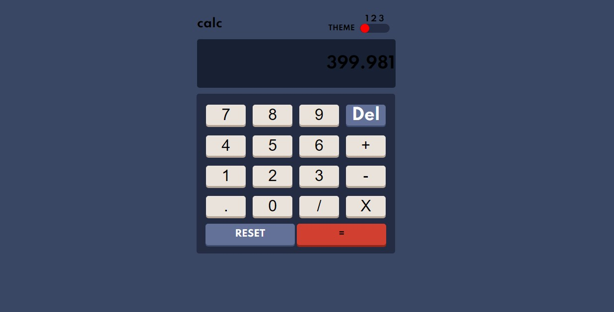

# Frontend Mentor - Calculator app solution
[solution](https://awesome-wescoff-02a482.netlify.app/)
This is a solution to the [Calculator app challenge on Frontend Mentor](https://www.frontendmentor.io/challenges/calculator-app-9lteq5N29).  

## Table of contents

- [Overview](#overview)
  - [The challenge](#the-challenge)
  - [Screenshot](#screenshot)
  - [Links](#links)
- [My process](#my-process)
  - [Built with](#built-with)
  - [What I learned](#what-i-learned)
  - [Useful resources](#useful-resources)
- [Author](#author)
## Overview

### The challenge

Users should be able to:

- See the size of the elements adjust based on their device's screen size
- Perform mathmatical operations like addition, subtraction, multiplication, and division
- Adjust the color theme based on their preference
- **Bonus**: Have their initial theme preference checked using `prefers-color-scheme` and have any additional changes saved in the browser

### Screenshot




### Links

- Solution URL: [Solution URL here](https://github.com/Sandesh4141/Calculator-app)
- Live Solution: [click here](https://awesome-wescoff-02a482.netlify.app/)

## My process

### Built with

- Semantic HTML5 markup
- CSS custom properties
- Flexbox
- CSS Grid
- Mobile-first workflow
- Css Variables

### What I learned

```html
<div class="theme-change-btns" id="slider-container">
	<div id="slider" class="rounded"> </div>
	</div>
```


```js
resetButton.addEventListener('click', resetAll);
numbers.forEach(button => {
    button.addEventListener('click', () => {
        const regexp = /^[+-]?([0-9]+([.][0-9]*)?|[.][0-9]+)$/;
        if (regexp.test(variables[id] + button.innerText)) {
            variables[id] += button.innerText;
            updateScreen();
        }
    });
});
```
### Useful resources

- [w3schools](https://www.w3schools.com) - I really liked this pattern and will use it going forward.
- [geeks for geeks](https://www.geeksforgeeks.org) - This is an amazing article which I'd recommend it to anyone still learning this concept.
- [tutorials-point](https://www.tutorialspoint.com) - Everthing that you need to build projects.

## Author

- Frontend Mentor - [@Sandesh4141](https://www.frontendmentor.io/profile/Sandesh4141)
- Twitter - [@sandesh-sp](https://www.twitter.com/@Sandesh32971351)
- Instagram - [@sandesh.sp41](https://www.instagram.com/sandesh.sp41)

